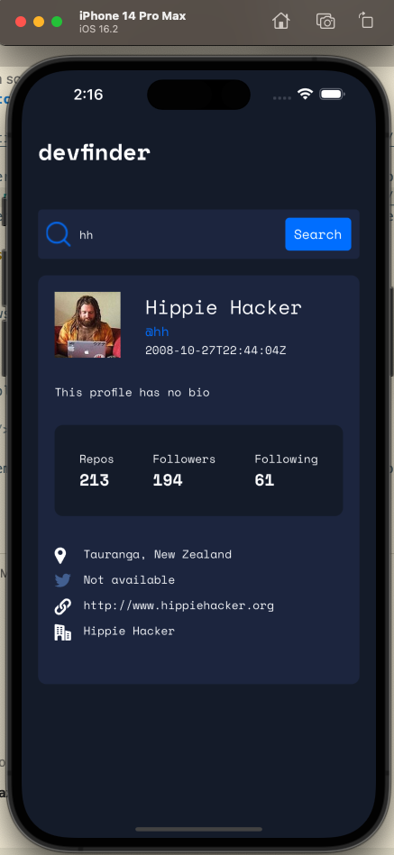
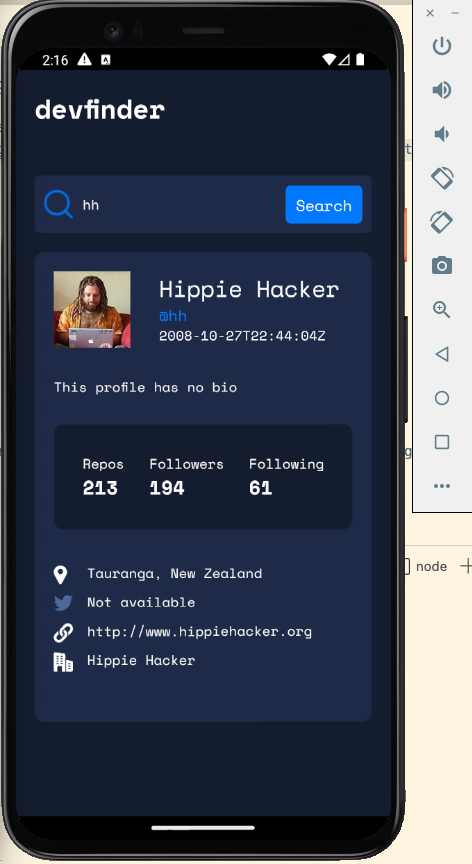

# Design, develop, and test an app from scratch in React Native

This app searches for and displays GitHub user information. Thi app aims to teach all three aspects, development, design and testing, in React Native. This project is inspired by [this Frontend Mentor project](https://www.frontendmentor.io/challenges/github-user-search-app-Q09YOgaH6). This application was adapted and improved based on what ChatGPT generated. The prompts that were used to solicit the rough code base from ChatGPT include:

* build an app that searches for and displays GitHub user information using React Native
* improve the style of this app

This application will render to iOS as follows:

This application will render to Android as follows:

This appliation is a teaching and learning demo developed by [Qiang Hao](https://qhao.info/) for CSCI 412 Mobile Development at Western Washington University.

